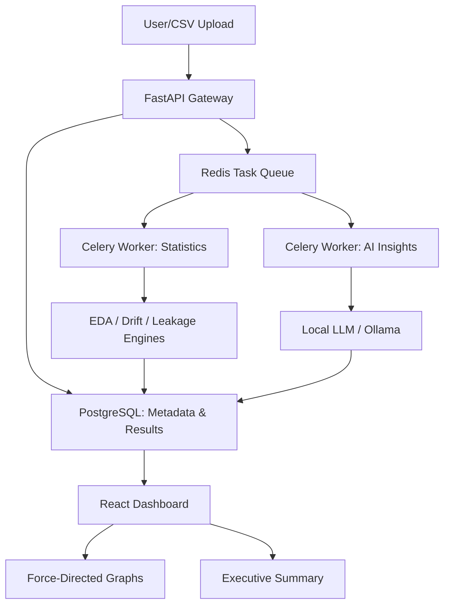

# 🛡️ DataGuard: Enterprise ML Observability & Data Intelligence

**DataGuard** is a production-grade ML Observability platform designed to detect data quality issues, silent distribution shifts, and predictive "cheating" (leakage) in machine learning pipelines. 

Built with a high-performance **FastAPI** backend and an **interactive React** dashboard, it transforms raw data into actionable **AI-driven insights** using a domain-specific fine-tuned LLM.

---

## 🚀 Key Engineering Pillars

### 1. 🧠 AI-Driven Insight Engine
*   **Fine-tuned Model**: Integrates a domain-specific LLM (Lily-1.5B) fine-tuned on data quality instruction sets using **Unsloth & LoRA**.
*   **Automated Root Cause Analysis**: Instead of raw numbers, get natural language narratives explaining *why* your data is failing.

### 2. ⚡ Distributed Async Architecture
*   **Task Orchestration**: Uses **Celery + Redis** to offload heavy statistical computations (EDA, Drift) to background workers.
*   **Real-time Tracking**: Interactive progress bars and polling keep the UI responsive during massive dataset scans.

### 3. 📉 ML Observability Suite
*   **Drift Intelligence**: Implements **Population Stability Index (PSI)** and **KS-Tests** to monitor silent model degradation.
*   **Leakage Discovery**: Force-directed network graphs visually expose hidden correlations between features and targets.

### 4. 🏛️ Executive Intelligence
*   **Global Health Score**: A weighted integrity metric (0-100) aggregating Quality, Drift, and Leakage risks.
*   **Command Center**: A premium dashboard with integrity trends and risk exposure analytics for ML Leads.

---

## 🛠️ Technology Stack
*   **Backend**: Python (FastAPI, SQLAlchemy 2.0, Celery, Pydantic)
*   **Frontend**: React (TypeScript, Vite, TailwindCSS, ECharts, Framer Motion)
*   **Data Layer**: PostgreSQL (Persistent storage), Redis (Task Queue)
*   **ML/AI**: Scipy, Scikit-learn, Pandas, Unsloth (Fine-tuning), Ollama (Local Inference)

---

## 🏗️ System Architecture



---

## 🚦 Getting Started

### Prerequisites
*   Python 3.10+
*   PostgreSQL & Redis
*   Ollama (running `lily-1.5b` or `llama3`)

### Backend Setup
```bash
# Install dependencies
pip install -r requirements.txt

# Start Celery Worker
celery -A src.core.celery_app worker --loglevel=info

# Start FastAPI
uvicorn src.api.main:app --reload
```

### Frontend Setup
```bash
cd dashboard
npm install
npm run dev
```

---

## 🏆 Resume Highlights
*   **Engineered** a distributed ML observability platform capable of processing 1M+ rows asynchronously using Celery and Redis.
*   **Implemented** statistical drift detection (PSI) and leakage discovery algorithms used in industry-standard tools like Great Expectations and EvidentlyAI.
*   **Architected** a persistent data layer with SQLAlchemy 2.0 to track data integrity trends over time.
*   **Developed** a custom AI insight engine using LoRA adapters for fine-tuning local 1.5B parameter models.
