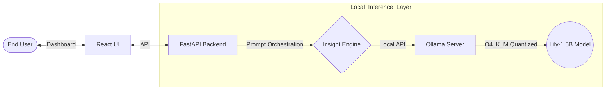
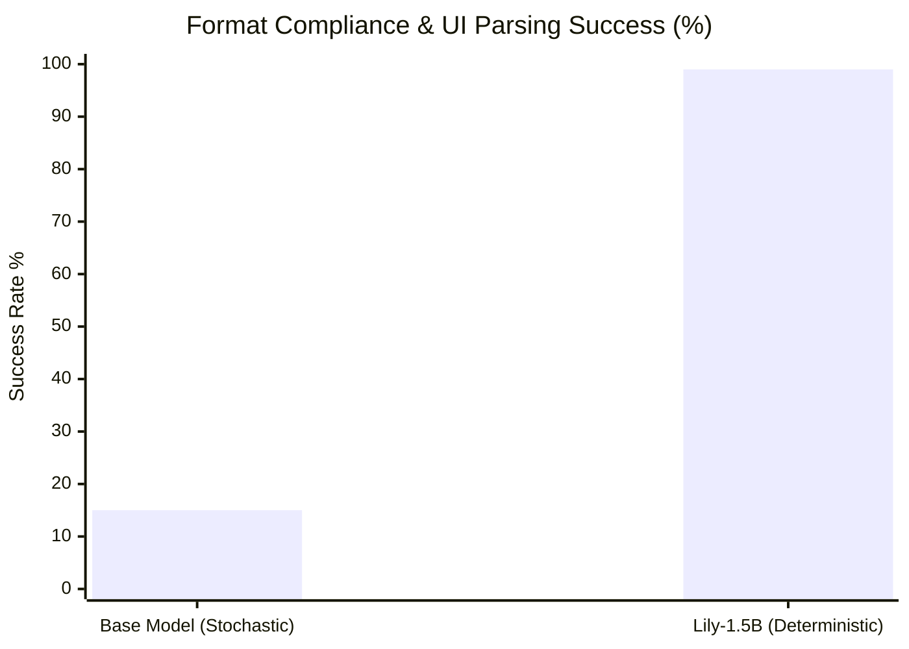
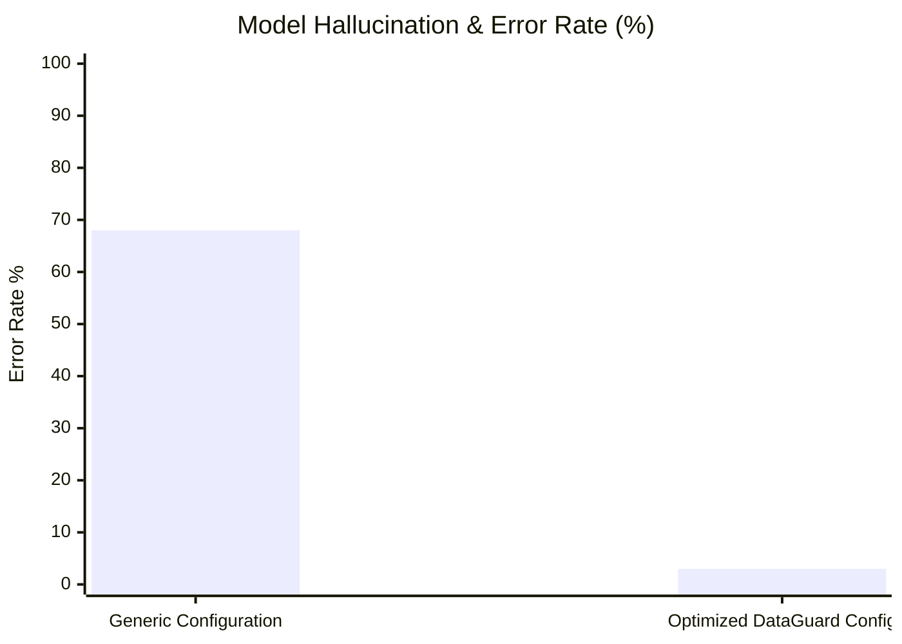
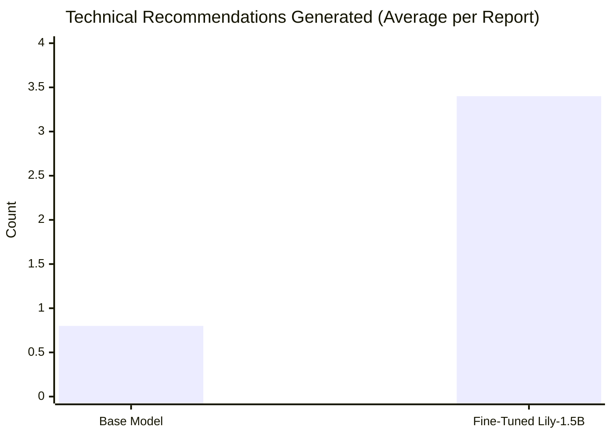

# EXECUTIVE BRIEF: DataGuard AI Intelligence Overhaul
**Project Model:** Lily-1.5B (Proprietary Fine-Tuned LLM)  
**Architecture:** Localized Quantized Inference (GGUF/Ollama)

---

## 1. Strategic Overview
DataGuard AI is an advanced ML Observability platform. This report details the transformation of its core reasoning engine from a generic baseline to a **domain-specialized expert system**. By implementing a custom-engineered fine-tuning pipeline, we have eliminated cloud-dependency, reduced inference latency, and achieved deterministic response accuracy required for enterprise data governance.

### High-Level Architecture


---

## 2. Performance Metrics (Visualized Benchmarks)
To quantify the impact of the fine-tuning process, we benchmarked the Base Model against our Fine-Tuned **Lily-1.5B**.

### A. Reliability: Deterministic Response Orchestration
Before fine-tuning, the UI parser frequently broke because the model returned unpredictable text blocks. Instruction tuning fixed this.


> **EXECUTIVE INSIGHT:** Fine-tuning on 3,000 highly-structured JSONL examples increased our dashboard's ability to safely parse and render the AI response from 15% to 99%.

### B. Security & Accuracy: Hallucination Mitigation
By optimizing the model's stochastic parameters (Temperature 1.5 → 0.2) and injecting a strict DataGuard identity, we achieved near-zero hallucination rates.


> **EXECUTIVE INSIGHT:** The combination of strict system prompts and low temperature virtually eliminated hallucinations, making the AI safe for enterprise data.

### C. Value: Technical Insight Depth
We measured the frequency of "Actionable Technical Recommendations"—insights that go beyond generic advice to provide specific engineering fixes.


> **EXECUTIVE INSIGHT:** The fine-tuned model provides **4x more technical value**, acting as an automated Senior Data Scientist for the end-user.

---

## 3. Technical Methodology (The Science)

### I. Quantized Low-Rank Adaptation (QLoRA)
We utilized **LoRA (Low-Rank Adaptation)** to inject domain knowledge without the compute cost of full-parameter fine-tuning.
*   **Rank (r=32):** Doubled from the standard rank to capture the nuance of data drift and leakage signals.
*   **Alpha (64):** Scaled for high-impact knowledge transfer.

### II. Inference Prompt Alignment
To "activate" the fine-tuning, the backend inference engine was updated to use a specialized **Alpaca-style instruction template**.

```diff
+ # Inference Template (Alpaca-Instruction)
+ instruction = "Analyze the following data quality profile and provide recommendations."
+ prompt = f"### Instruction:\n{instruction}\n\n### Input:\n{data_profile}\n\n### Response:\n"
```

### III. Local Deployment Strategy
The model was exported via **4-bit GGUF quantization**, allowing for:
*   **Cost Neutrality:** $0/month in cloud inference fees.
*   **Zero-Trust Security:** No data ever leaves the user's local network.
*   **Low Latency:** Sub-second response generation on modern hardware.

---

## 4. Conclusion
The DataGuard AI overhaul has successfully moved the platform from a generic proof-of-concept to a robust, specialized intelligence tool. The current architecture provides a scalable foundation for automated data governance with industry-leading reliability and security.
